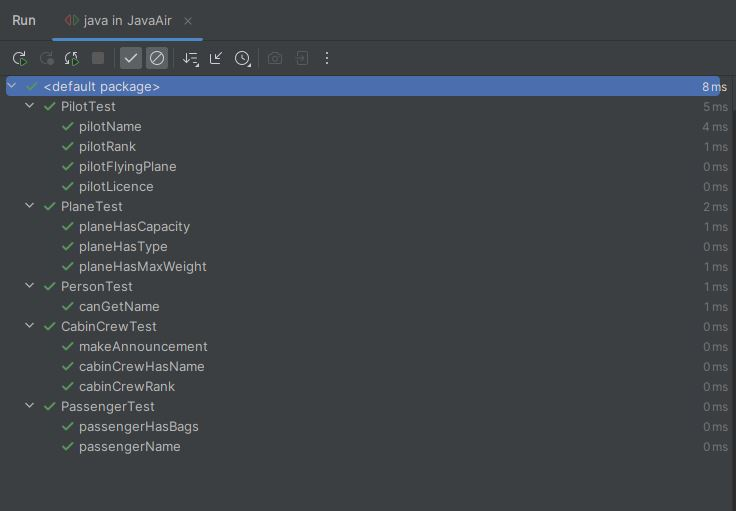

# JavaAir

[](https://skillicons.dev)

JavaAir is a Test Driven Development project in Java using IntelliJ IDE.


## Getting Started

Clone this Repository
Download & Install [IntelliJ](https://www.jetbrains.com/idea/) 
Open the Project & Navigate to the Test Folder

```
JavaAir/src/test
```

Run the Folder called 'java' by right clicking & selecting Run 'Tests in 'java''


##Results

When the test run you will get the following results

